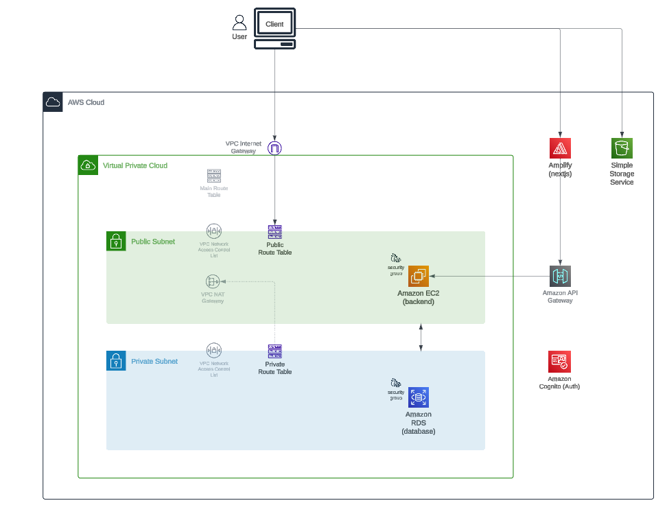

# Inventory Manager
Inventory Management Application Project to get familiar with some AWS services

All data is dummy data to build to project and graphs.

### Technologies Used
- Next.js
- Node.js, Express
- PostreSQL, Prisma
- Tailwind, MaterialUI, Recharts
- AWS

### AWS Tech Used
- Amplify, S3, API Gateway, EC2, RDS, VPC, Subnets

